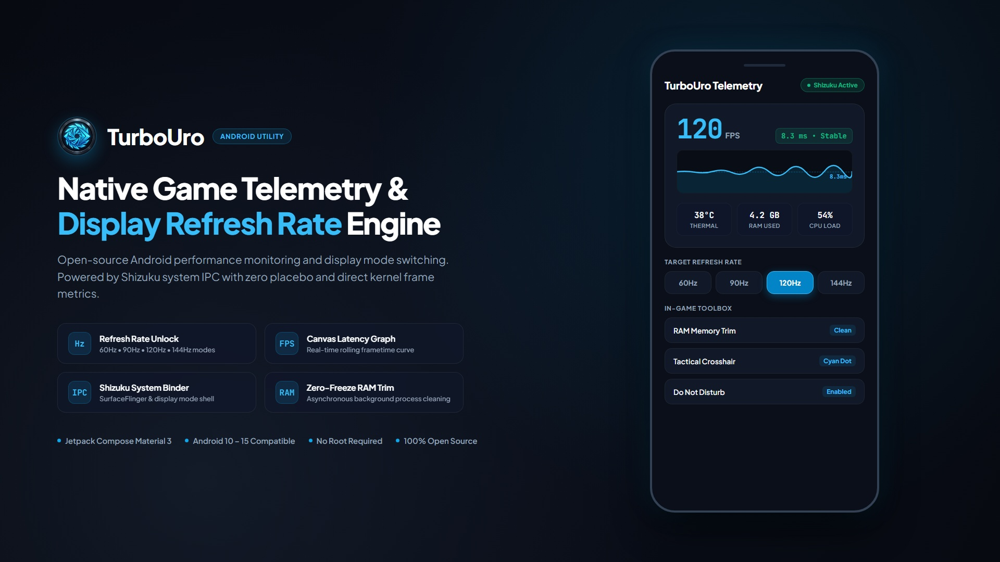

# TurboUro



Aplikasi utilitas performa dan telemetri game Android modern berbasis API sistem native. TurboUro berfokus pada transparansi metrik hardware riil, konfigurasi profil game per aplikasi, dan rangkaian alat bantu in-game (Power Game Suite) yang ergonomis dan non-intrusif.

---

## Prinsip Desain & Rekayasa Sistem

Optimalisasi performa game di platform Android membutuhkan pemahaman mendalam mengenai manajemen memori, siklus hidup proses, dan pipeline grafis sistem. Upaya menghentikan proses latar belakang secara paksa dan sinkron kerap memicu restart loop dari dependensi sistem, yang dapat menambah beban kerja CPU dan menyebabkan ketidakkonsistenan frame time.

TurboUro dibangun dengan pendekatan rekayasa yang terukur dan transparan:
- **Telemetri Hardware Riil**: Metrik frame rate, latensi frame time, temperatur baterai, serta utilisasi CPU/GPU disinkronkan langsung dari Android Choreographer, dumpsys SurfaceFlinger, `HardwarePropertiesManager`, dan kernel sysfs.
- **Pembersihan Memori Asinkron**: Pengelolaan alokasi RAM berjalan di thread latar belakang (coroutine `Dispatchers.IO`) menggunakan standar `ActivityManager.killBackgroundProcesses` dan `trim-memory`, sehingga tidak menimbulkan freeze atau jeda pada thread antarmuka pengguna.
- **Aksesibilitas & UI Manusiawi**: Mengikuti standar kontras WCAG AA (rasio kontras teks minimal 4.5:1), target sentuh jari yang nyaman (minimal 48dp), dan tata letak responsif bertema dark slate.
- **Ikon Launcher Sesuai Standar**: Menggunakan format Adaptive Icons dengan background solid `#0B0F19` dan aset visual lingkaran penuh di seluruh densitas layar.

---

## Fitur Utama (Power Game Suite)

### 1. Docked Sidebar Telemetry Overlay
- **Docking Ergonomis**: Tab trigger ramping menempel rapi di sisi tepi layar, bebas digeser vertikal, dan tidak mengganggu area kendali jari saat bermain.
- **Kontrol Ekspansi Cepat**: Sentuh handle untuk membuka panel telemetri, dan sembunyikan kembali dengan satu ketukan.
- **Metrik Real-Time**:
  - Live FPS via Choreographer & dumpsys SurfaceFlinger
  - Latensi frame time dalam milidetik (ms)
  - Display refresh rate aktual (Hz)
  - Temperatur baterai dan persentase daya
  - Estimasi pembebanan CPU dan GPU

### 2. Visual Frame Time Graph (Mini-HUD)
- Canvas grafis terintegrasi yang merender gelombang latensi 40 sampel frame terakhir secara langsung di dalam sidebar.
- Menampilkan garis panduan latensi target (misal 8.3ms untuk 120Hz atau 16.6ms untuk 60Hz) untuk mengidentifikasi frame drop dan micro-stutter seketika.

### 3. Unlock Display Refresh Rate (via Shizuku)
- Membuka limit refresh rate layar pada target spesifik: **60 Hz**, **90 Hz**, **120 Hz**, atau **144 Hz**.
- Menerapkan konfigurasi multi-node sistem, Android user-preferred display mode (`cmd display set-user-preferred-display-mode`), dan SurfaceFlinger service calls untuk menembus pembatasan 60Hz pada ROM OEM.
- Mengembalikan setelan layar secara otomatis saat sesi permainan ditutup.

### 4. Quick In-Game Toolbox
- **One-Tap RAM Cleaner**: Membebaskan memori aplikasi background seketika dari sidebar in-game tanpa freeze UI.
- **Mode Jangan Ganggu (DND)**: Menonaktifkan notifikasi dan panggilan masuk yang mengganggu selama sesi permainan.
- **Kunci Kecerahan Layar**: Mencegah penurunan kecerahan otomatis (*thermal dimming*) saat perangkat memanas.
- **Tactical Crosshair Assistant**: Overlay bidikan mengambang di titik tengah layar dengan 3 pilihan gaya (*Cross*, *Dot*, *Circle*) dan 4 warna kontras tinggi tanpa memblokir input sentuh game.

### 5. Smart Thermal Haptic Warning
- Memantau tren suhu hardware secara reaktif.
- Apabila temperatur perangkat mencapai ambang batas kritis (43°C ke atas), sidebar overlay mengaktifkan aksen visual peringatan dan memberikan getaran haptic lembut berkala untuk mencegah thermal throttling berlebih.

### 6. Integrasi Android Game Mode API
- Terhubung langsung dengan `GameManager` resmi (Android 12+) untuk menetapkan mode performa (`Performance`, `Standard`, `Battery`) per judul game.

---

## Arsitektur & Teknologi

- **Bahasa**: Kotlin (Coroutines, StateFlow)
- **UI Toolkit**: Jetpack Compose, Material 3, Android Views via WindowManager Overlay
- **System IPC**: Shizuku API (RikkaX Binder Interface)
- **Kompatibilitas**: Android 8.0 (API 26) hingga Android 15 (API 35)
- **Arsitektur CPU**: ARM64-v8a, armeabi-v7a, x86_64
- **Akses Root**: Tidak wajib (fitur unlock display & dumpsys lanjutan menggunakan Shizuku Shell)

---

## Izin Aplikasi

1. **Tampilan di Atas Aplikasi Lain (`SYSTEM_ALERT_WINDOW`)**: Merender sidebar telemetri dan overlay crosshair di atas game.
2. **Akses Data Penggunaan (`PACKAGE_USAGE_STATS`)**: Mendeteksi peluncuran dan penutupan game secara otomatis.
3. **Notifikasi Layanan Sistem (`POST_NOTIFICATIONS`)**: Menjaga foreground service pemantau tetap stabil di background.
4. **Pengecualian Hemat Baterai (`REQUEST_IGNORE_BATTERY_OPTIMIZATIONS`)**: Memastikan frekuensi sampling telemetri tidak terinterupsi saat layar menyala.
5. **Getaran (`VIBRATE`)**: Memberikan umpan balik haptic saat suhu perangkat menembus batas aman.
6. **Shizuku API (Opsional)**: Menjalankan eksekusi shell tingkat sistem tanpa akses root.

---

## Cara Instalasi & Penggunaan

1. Unduh rilis berkas APK dari halaman rilis repository.
2. Pasang di ponsel Android Anda.
3. Buka TurboUro, masuk ke **Pusat Izin**, lalu aktifkan izin *Tampilan di Atas Aplikasi Lain* dan *Akses Data Penggunaan*.
4. (Opsional untuk fitur Unlock FPS & Telemetri Lanjutan):
   - Pasang dan aktifkan layanan Shizuku via Wireless Debugging atau ADB.
   - Buka menu Shizuku di TurboUro dan tekan **Izinkan Shizuku**.
5. Pilih game favorit Anda dari pustaka, sesuaikan profil target refresh rate serta toolbox yang diinginkan, dan jalankan game.

---

## Kompilasi dari Source Code

Pastikan Android Studio Ladybug (atau versi lebih baru) dan JDK 17 telah terpasang.

```bash
git clone https://github.com/lavenderpoet607/TurboUro.git
cd TurboUro

.\gradlew.bat assembleRelease

.\gradlew.bat bundleRelease
```

Output kompilasi:
- **APK Rilis**: `app/build/outputs/apk/release/app-release.apk`
- **Play Store App Bundle**: `app/build/outputs/bundle/release/app-release.aab`

---

## Lisensi

Proyek ini dirilis di bawah lisensi terbuka. Kontribusi, pelaporan bug, dan saran pengembangan komunitas sangat diapresiasi.
